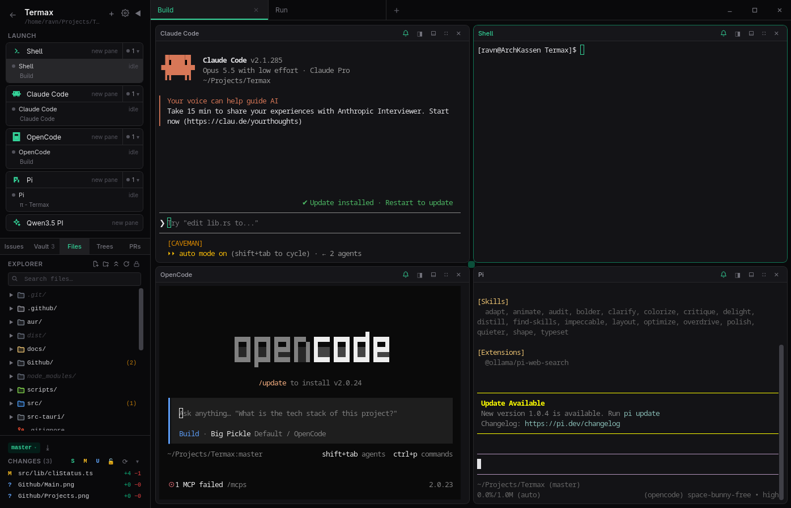
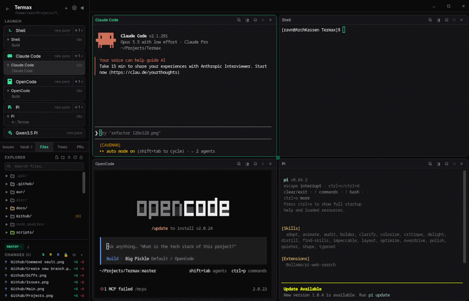
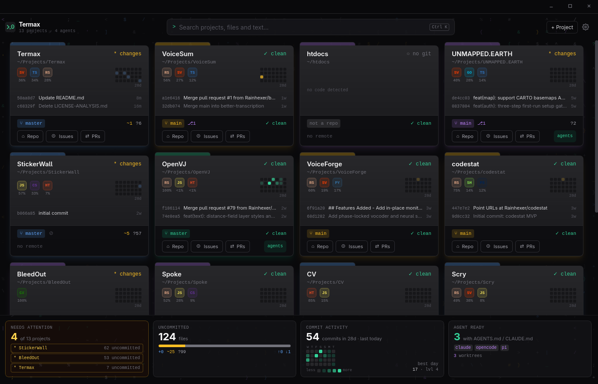
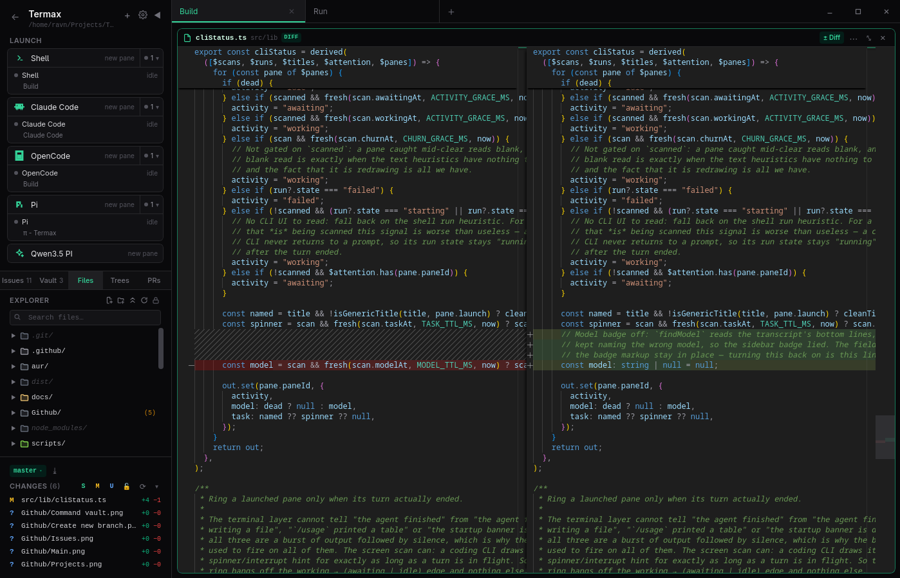
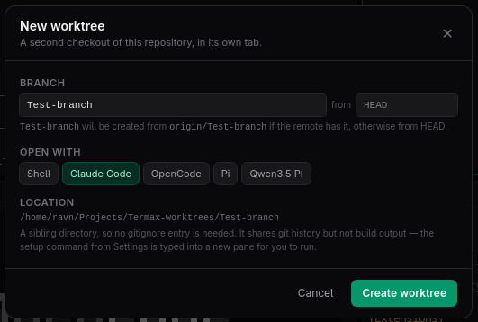
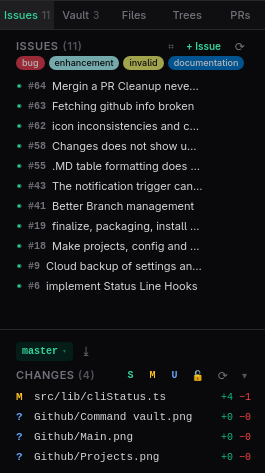
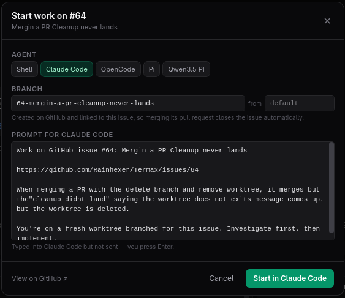
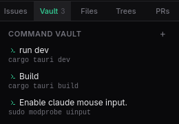

# Termax >_0

 

**A terminal multiplexer and project manager built for AI coding agents.** Tile terminals, run Claude Code, OpenCode, Pi or any other CLI agent side by side, watch what they change, and manage worktrees, issues and pull requests — all inside one focused window on **Linux**, **macOS** and **Windows**.

## Get Termax

Pre-built installers for every platform are on the [Releases page](https://github.com/Rainhexer/Termax/releases/latest).
Per-platform install commands and first-launch notes are in [INSTALL.md](INSTALL.md).

Releases are code signed and ship a GPG-signed `SHA256SUMS` manifest. See
[docs/SIGNING.md](docs/SIGNING.md) for how to verify a download and what the
signatures do and do not cover. To build from source, see [BUILD.md](BUILD.md).

## Features

### Tiled terminals that remember

Split panes horizontally or vertically, drag panes and tabs to rearrange them, and resize freely. Every project has its own tabs and layout, saved on close and restored on the next open. Terminals run on a real PTY with full VT100/xterm support, WebGL rendering where it is available, and per-pane font zoom (`Ctrl` + `+` / `-` / `0`).

### One-click agent launchers

Termax detects coding agents on your `$PATH` — Claude Code, OpenCode, Pi, Aider, GitHub Copilot CLI and others — and shows their versions. Launch any of them, or a plain shell, into a new pane in your project directory. Add your own launchers (name, command, icon) for any other tool. A pane gets a bell when a coding CLI's turn actually ends, and the sidebar shows whether each agent is working, waiting for you, or idle.

### Home screen for all your projects

The home screen shows every project at a glance: branch, clean/dirty state, languages, a 28-day commit-activity grid, recent commits, and quick links to the repo, issues and pull requests. Summary tiles flag projects that need attention, count uncommitted files, and show which projects are ready for agents. `Ctrl` + `K` searches across all projects, files and file contents.

### Live change tracking and diffs

Termax watches the project while an agent works. Every create, edit and delete shows up in the **Changes** list with `+`/`−` line counts, diffed against the last commit (or a session-start snapshot outside git). Click a file to open a side-by-side Monaco diff.

### Worktrees

Give each task its own branch and checkout without leaving the window. Create a worktree from any branch, pick the agent to open in it, and Termax opens it in its own tab. An optional setup command (for example `npm ci`) is offered in the new pane, never run silently.

### GitHub issues and pull requests

Browse, create and view issues and pull requests from the sidebar, and hand an issue straight to an agent: Termax creates a linked branch and worktree, opens your chosen agent, and types an editable prompt built from the issue — it is never sent until you press Enter. Merge PRs after a preflight of checks, reviews and mergeability. All GitHub access goes through the [`gh` CLI](https://cli.github.com/), so Termax never sees or stores a token.

<table>
  <tr>
    <td></td>
    <td></td>
  </tr>
</table>

### Command vault

Save the commands you keep retyping — `cargo tauri dev`, `docker compose up`, a long agent prompt — per project, and run any of them in a terminal pane with one click.

### Editor and explorer

A built-in file explorer (search, icons, multi-select, drag and drop, clipboard, undo) opens files in a Monaco editor pane next to your terminals. Markdown, HTML, SVG and image files have a live preview. Because an agent and you may edit the same file, saves are **three-way merged** against what is on disk: non-overlapping edits from both sides are kept, and overlapping edits are surfaced instead of silently overwritten.

### Safe by default

- **Folder trust.** Termax will not run git in a folder until you trust it, because `.git/config` can execute code. Untrusted folders open in snapshot mode.
- **No network access of its own.** The app's content-security policy only allows local IPC; GitHub features shell out to `gh`, and nothing is called on startup.
- **Local previews are token-gated.** HTML previews are served from loopback only, behind a per-session random token.
- **Signed releases** with verifiable checksums.

### Make it yours

Eight built-in themes (Termax Dark, Tokyo Night, Dracula, Nord, Gruvbox Dark, Catppuccin Mocha, Solarized Dark, GitHub Light) plus your own, editable per UI, terminal and editor. Font, cursor style, scrollback, renderer, shell, bell behaviour and issue/PR launcher defaults are all in Settings.

## Tech stack

| Layer | Technology |
|-------|------------|
| App shell | [Tauri v2](https://v2.tauri.app/) (Rust) |
| Frontend | Svelte 5 + TypeScript, Tailwind CSS 4, Vite |
| Terminal | xterm.js (WebGL / canvas renderers) |
| Editor and diffs | Monaco Editor |
| PTY | portable-pty + vt100 screen model |
| File watching | notify |
| Diff and merge | similar |

See [docs/ARCHITECTURE.md](docs/ARCHITECTURE.md) for how the pieces fit together.

## Where your data lives

Termax keeps `settings.json`, `projects.json` and `trusted.json` in its app data directory:

| macOS | Linux | Windows |
|-------|-------|---------|
| `~/Library/Application Support/dev.ravn.termax/` | `~/.local/share/dev.ravn.termax/` | `%APPDATA%\dev.ravn.termax\` |

## Documentation

- [INSTALL.md](INSTALL.md) — installing a release on each platform
- [BUILD.md](BUILD.md) — building and packaging from source
- [docs/ARCHITECTURE.md](docs/ARCHITECTURE.md) — architecture overview
- [docs/SIGNING.md](docs/SIGNING.md) — code signing and release verification
- [CHANGELOG.md](CHANGELOG.md) — release notes

## License

Termax is free software released under the [GNU General Public License v3.0](LICENSE).
